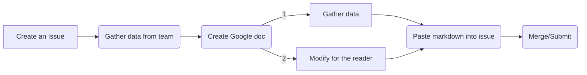

# Program Update Workflow Example

<table>
  <tr>
   <td><strong>#</strong>
   </td>
   <td><strong>Key results</strong>
   </td>
   <td><strong>Sponsor</strong>
   </td>
  </tr>
  <tr>
   <td>1
   </td>
   <td>Usage Based <a href="https://docs.google.com/document/d/1vMZqU3uzJLJtFFdDqC0yxCH3RAOItkbYQDzNdcmGDNg/edit#heading=h.40hf6tcmg5xa">Business data models</a> are designed and have owners
   </td>
   <td>Julia Metcalf
   </td>
  </tr>
  <tr>
   <td>2
   </td>
   <td>Invest in and scale up Kusto as the defacto ad-hoc product analytics and dashboarding tool, growing MEU (2d28) from 180 to 400.
   </td>
   <td>Arfon Smith
   </td>
  </tr>
  <tr>
   <td>3
   </td>
   <td>Deliver Proxima DWH PoC that enables querying of Hydro and monolith MySQL data in the Proxima staff-ship instance. 
   </td>
   <td>Todd Manion
   </td>
  </tr>
  <tr>
   <td>4
   </td>
   <td>Data Warehouse Infrastructure fundamentals 100% green on scorecards and clusters
   </td>
   <td>Vikram Kulkarni
   </td>
  </tr>
</table>
