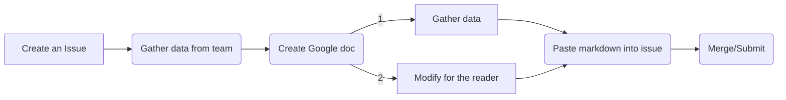

# Program Update Workflow Example

```mermaid
    graph LR;
    A[Create an Issue] -->B(Gather data from team);
    B-->C(Create Google doc);
    C -->|1| D[Gather data];
    C -->|2| E[Modify for the reader];
    D --> F;
    E --> F(Paste markdown into issue);
    F -->G(Merge/Submit);
```

